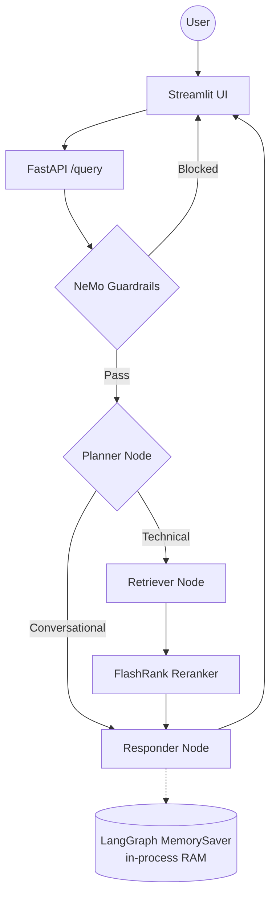
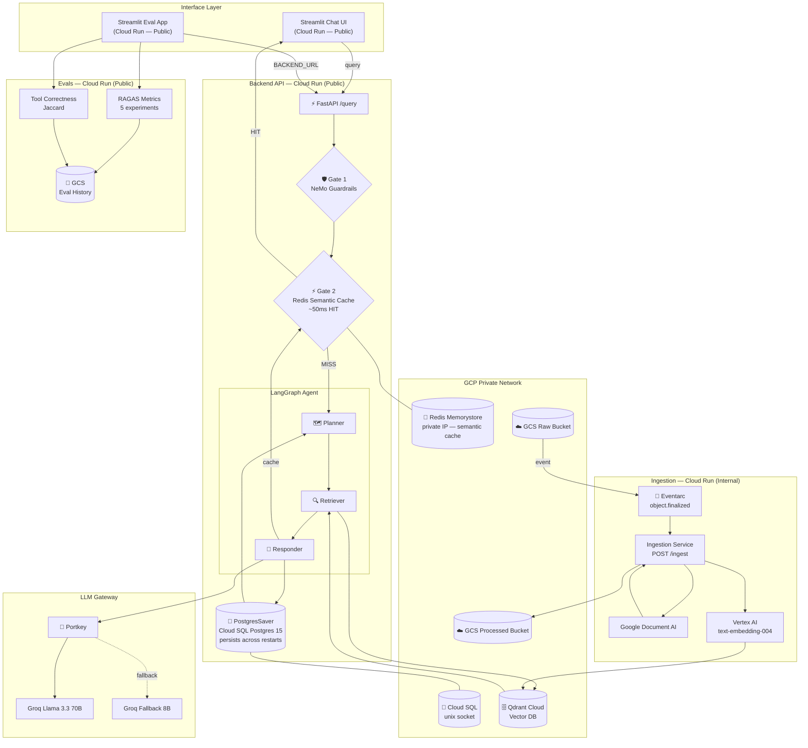

# Enterprise Agentic RAG

A production-grade RAG system built with **LangGraph**, **NeMo Guardrails**, **Portkey LLM Gateway**, **RAGAS Evals**, and **Google Cloud Platform**. Deployed as four independent microservices on Cloud Run, managed entirely with Terraform.

---

## Key Features

- **Agentic Intelligence** — LangGraph cyclic graph: Planner → Retriever → Responder with persistent memory across sessions
- **Two-Gate Safety** — Gate 1: NeMo Guardrails (blocks jailbreak/off-topic); Gate 2: Redis Semantic Cache (serves cached answers in ~50ms)
- **Persistent Memory** — LangGraph `PostgresSaver` on Cloud SQL — conversation history survives container restarts and scale-to-zero
- **LLM Gateway** — Portkey routes all LLM calls with automatic fallback (Llama 3.3 70B → Llama 3.1 8B), full dashboard visibility
- **Enterprise Search** — Qdrant Cloud vector search + FlashRank local reranker
- **Event-Driven Ingestion** — Upload a file to GCS → Eventarc fires → Ingestion service auto-parses, embeds, and indexes. No manual steps.
- **Evaluation Suite** — RAGAS (5 metrics) + Jaccard Tool Correctness. GCS-persisted history. Deployed as its own Cloud Run service.
- **Full Observability** — Pydantic Logfire + LangSmith traces across every agent node and eval run

---

## Architecture

### Monolithic (v1)

The original single-process application — all components in one container, in-memory state, manual ingestion.



### Scalable Enterprise (v2 — current)

Four independent microservices, event-driven ingestion, persistent memory, semantic caching, and full IaC via Terraform.



---

## Project Structure

```text
├── app/
│   ├── agents/
│   │   ├── graph.py              # LangGraph graph + PostgresSaver checkpointer
│   │   ├── state.py              # AgentState schema
│   │   └── nodes/
│   │       ├── planner.py        # Intent classification node
│   │       ├── retriever.py      # Qdrant search + FlashRank reranker node
│   │       └── responder.py      # Answer generation node
│   ├── gateway/
│   │   └── client.py             # Portkey LLM gateway — primary + fallback routing
│   ├── guardrails/
│   │   ├── rails.py              # NeMo Guardrails integration
│   │   └── colang_rules.py       # Block/allow rule definitions
│   ├── ingestion/
│   │   ├── processor.py          # Dual-mode: CLI bulk load + Eventarc webhook (POST /ingest)
│   │   ├── chunking/
│   │   │   └── splitter.py       # Text splitting strategies
│   │   └── loaders/
│   │       ├── pdf.py            # Google Document AI PDF parser
│   │       ├── html.py           # HTML parser
│   │       ├── office.py         # DOCX / PPTX parser
│   │       └── text.py           # Plain text parser
│   ├── services/
│   │   ├── gcp/
│   │   │   ├── database_service.py      # psycopg3 connection pool (unix socket)
│   │   │   └── redis_semantic_cache.py  # Cosine-distance semantic cache
│   │   └── retrieval/
│   │       ├── embedding.py      # Vertex AI text-embedding-004 (lazy-loaded)
│   │       ├── qdrant_service.py # Vector search client
│   │       └── ranking_service.py # FlashRank reranker
│   ├── config.py                 # Centralized env var management
│   └── main.py                   # FastAPI entrypoint — two gates + /query
│
├── evals/
│   ├── app.py                    # Streamlit 4-tab eval dashboard
│   ├── pipeline.py               # Phase 1 — live /query calls + Groq summarization
│   ├── metrics.py                # Phase 2 — RAGAS scoring with GoogleEmbeddings
│   ├── guardrails_eval.py        # Guardrails TP/TN/FP/FN classification
│   ├── store.py                  # GCS persistence for eval history
│   ├── data_parser.py            # Golden dataset document parser
│   └── golden_dataset.json       # 15 RAG samples + 6 guardrail test cases
│
├── ui/
│   └── app.py                    # Streamlit chat interface
│
├── docker/
│   ├── backend.Dockerfile        # FastAPI + LangGraph + Guardrails + Redis + Postgres
│   ├── ui.Dockerfile             # Streamlit only (4 packages)
│   ├── ingestion.Dockerfile      # DocAI + Qdrant + parsers
│   └── evals.Dockerfile          # RAGAS + Vertex AI + Streamlit
│
├── terraform/
│   ├── main.tf                   # VPC, GCS buckets, Redis, Eventarc SA IAM
│   ├── cloud_run.tf              # All 4 Cloud Run services + public IAM
│   ├── database.tf               # Cloud SQL Postgres 15
│   ├── ingestion.tf              # Ingestion service + Eventarc trigger (POST /ingest)
│   ├── variables.tf              # Input variable declarations
│   ├── provider.tf               # GCP + hashicorp/time providers
│   └── output.tf                 # backend_url, ui_url, evals_url, ingestion_url
│
├── notebooks/
│   ├── 01_guardrails.ipynb       # NeMo Guardrails walkthrough
│   ├── 02_llm_gateway.ipynb      # Portkey gateway exploration
│   └── 03_evals.ipynb            # RAGAS metrics walkthrough
│
├── DATA/
│   └── true_data/                # Golden documents (Kubernetes, Databricks)
│
├── DOCS/                         # 24 architectural and operational guides
├── cloudbuild.yaml               # Parallel build of all 4 Docker images
├── cloudbuild-evals.yaml         # Targeted evals-only rebuild
├── requirements.txt              # Monolith / local dev dependencies
├── requirements-backend.txt      # Backend service dependencies
├── requirements-evals.txt        # Evals service dependencies
├── requirements-ingestion.txt    # Ingestion service dependencies
└── requirements-ui.txt           # UI service dependencies (4 packages)
```

---

## Tech Stack

| Layer | Technology |
|-------|-----------|
| Agent Orchestration | LangGraph (cyclic graph) |
| LLMs | Groq Llama 3.3 70B + 3.1 8B via **Portkey** gateway |
| Guardrails | NeMo Guardrails (Gate 1) |
| Semantic Cache | Redis Memorystore + Vertex AI embeddings (Gate 2) |
| Persistent Memory | LangGraph `PostgresSaver` on Cloud SQL Postgres 15 |
| Vector DB | Qdrant Cloud |
| Reranking | FlashRank (local, zero-latency) |
| Embeddings | **Vertex AI text-embedding-004** |
| Document Parsing | Google Document AI (PDF OCR) |
| Auto-Ingestion | GCS → Eventarc → Cloud Run (internal) |
| Evaluation | RAGAS (5 metrics) + Jaccard Tool Correctness |
| Eval Storage | GCS (`eval-results/` prefix, persists across restarts) |
| Observability | Pydantic Logfire + LangSmith + Portkey Dashboard |
| Compute | Google Cloud Run (4 independent microservices) |
| IaC | Terraform (VPC, Cloud SQL, Redis, Eventarc, Cloud Run) |
| CI/CD | Google Cloud Build (parallel 4-image build) |
| Networking | Direct VPC Egress (no connector) |

---