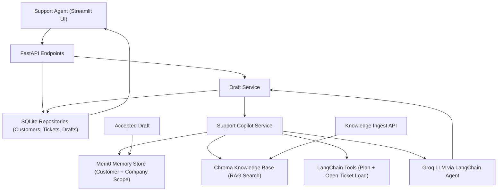

# AI-Powered Customer Support Agent Copilot (Project Report)

## 1. Project Title
AI-Powered Customer Support Agent Copilot with Memory, RAG, and Tool Calling

## 2. Duration
Approximate total effort: 6-8 hours

- Setup and prerequisites: 45-60 minutes
- Memory + tool-calling implementation: 90-120 minutes
- Modular backend/API implementation: 150-180 minutes
- Dockerization, testing, and CI/CD + EC2 deployment: 90-120 minutes

## 3. Introduction
This project builds an AI copilot that helps support agents generate high-quality ticket replies quickly.  
It combines FastAPI, LangChain agent orchestration, Mem0-based customer memory, and ChromaDB-powered knowledge retrieval.  
The system stores tickets/drafts in SQLite, exposes REST APIs, and provides a Streamlit dashboard for end users.  
It also includes Docker-based local execution and GitHub Actions workflows for CI/CD deployment to AWS EC2.

## 4. Aim
To build a production-style customer support automation pipeline that can:

- Ingest support knowledge documents
- Retrieve customer memory and policy context
- Call support tools for account/ticket checks
- Generate editable AI drafts for agent approval
- Persist accepted resolutions back into memory for future ticket quality improvement

## 5. Dataset Used
The project uses a hybrid dataset strategy:

- Knowledge Base Files (`.md`, `.txt`):
  - Domain policy/rule documents under `knowledge_base/`
  - Indexed into ChromaDB for retrieval-augmented responses
- Operational Ticket Data:
  - Ticket metadata, customer data, and drafts stored in SQLite (`data/support.db`)
  - Created through API or Streamlit UI during project runtime
- Memory Data:
  - Customer and company-level resolution memories stored through Mem0 + Chroma vector store (`data/chroma_mem0/`)

## 6. Tools & Technologies
- Programming Language: Python 3.11
- Backend API: FastAPI, Uvicorn
- Agent Framework: LangChain (`create_agent`), LangGraph checkpointer
- LLM Provider: Groq (`langchain-groq`)
- Memory: Mem0
- RAG Vector Store: ChromaDB
- Data Validation/Config: Pydantic, pydantic-settings
- Frontend Dashboard: Streamlit
- Database: SQLite
- Dependency + Runtime Tooling: `uv`
- Testing: Pytest
- Containerization: Docker, Docker Compose
- CI/CD & Deployment: GitHub Actions, AWS EC2 (SSH-based deployment)

## 7. Architecture Diagram

## 8. Key Steps / Modules
1. Project setup and environment configuration (`.env`, settings, directory bootstrap)
2. Ticket lifecycle data model with SQLite repositories (customers, tickets, drafts)
3. Knowledge base ingestion and chunked vector indexing in ChromaDB
4. Customer memory integration using Mem0 (customer and company scopes)
5. Tool-calling integration for support-specific checks (plan details, open ticket load)
6. Copilot service orchestration (memory + RAG + tools + LLM generation)
7. Draft creation flow (automatic background draft and manual regeneration APIs)
8. Draft acceptance workflow (ticket resolution + resolution memory persistence)
9. Streamlit dashboard for ticket creation, draft review/edit, and memory probing
10. Dockerized runtime, basic tests, GitHub Actions CI, and EC2 deployment pipeline

## 9. Learning Outcomes
After completing this project, learners will be able to:

- Design modular AI application architecture using routers, services, integrations, and repositories
- Build and expose production-style REST APIs with FastAPI
- Implement retrieval-augmented generation (RAG) using ChromaDB
- Integrate long-term customer memory with Mem0 for context-aware responses
- Add LLM tool-calling to improve factuality and actionability of generated drafts
- Build an operational frontend dashboard with Streamlit
- Containerize multi-service AI applications with Docker Compose
- Set up CI/CD with GitHub Actions and deploy on AWS EC2
- Add structured context tracing for AI decisions (memory hits, KB hits, tool calls)
- Implement human-in-the-loop review via editable drafts and acceptance workflow

## 10. Screenshots

## 11. Optional Add-ons
- Add authentication and role-based access (agent/admin)
- Add asynchronous job queue for draft generation (Celery/RQ)
- Add observability (structured logs, tracing, metrics, error alerts)
- Expand tool-calling with real CRM/billing integrations
- Add feedback scoring and prompt/version evaluation tracking
- Improve UI/UX with richer agent workflow states and conversation history
- Add comprehensive test suite (unit, integration, API contract tests)
- Add rollback/blue-green deployment strategy for production safety

## 12. Resource Links (Optional)
- FastAPI: [https://fastapi.tiangolo.com/](https://fastapi.tiangolo.com/)
- Streamlit: [https://docs.streamlit.io/](https://docs.streamlit.io/)
- LangChain: [https://python.langchain.com/docs/introduction/](https://python.langchain.com/docs/introduction/)
- ChromaDB: [https://docs.trychroma.com/](https://docs.trychroma.com/)
- Mem0: [https://docs.mem0.ai/](https://docs.mem0.ai/)
- Docker Compose: [https://docs.docker.com/compose/](https://docs.docker.com/compose/)
- GitHub Actions: [https://docs.github.com/actions](https://docs.github.com/actions)
- AWS EC2: [https://docs.aws.amazon.com/ec2/](https://docs.aws.amazon.com/ec2/)

## 13. Final Checklist
- [ ] Project title is clear and specific to support automation
- [ ] Intro, aim, and dataset sections are complete
- [ ] Architecture diagram is included and readable
- [ ] All major modules/steps are documented
- [ ] Learning outcomes are clearly listed
- [ ] At least 2 screenshots are added (if required by mentor)
- [ ] Source code is pushed to GitHub repository
- [ ] Dockerized app runs locally (`api` + `dashboard`)
- [ ] Core API endpoint(s) and end-to-end flow are tested
- [ ] CI/CD workflow and deployment notes are validated
