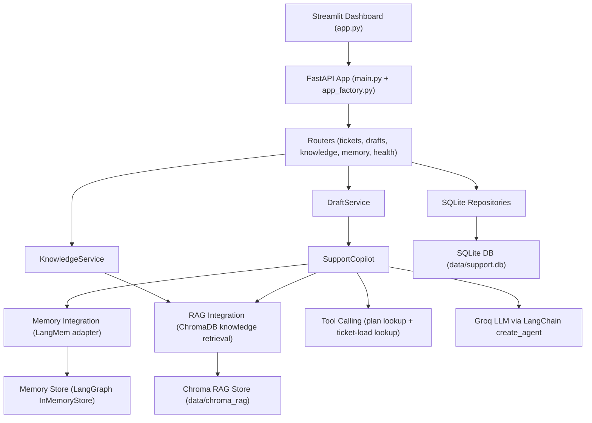

# Insurance Claims Copilot - Master Documentation

## 1) Architecture Flow

### High-level architecture

### Runtime request flow

1. Adjuster creates/selects a claim (FNOL) in Streamlit UI.
2. UI calls FastAPI routes.
3. Claim/customer data is read/written through SQLite repositories.
4. Recommendation generation route calls `SupportCopilot`.
5. `SupportCopilot` retrieves:
   - customer/company memories
   - relevant KB chunks (RAG)
   - tool outputs (plan + open-ticket load)
6. Agent runtime (`create_agent`) generates a recommendation draft + structured context metadata.
7. Recommendation draft is persisted in `drafts` table.
8. On draft approval, claim status is set to `resolved` and accepted recommendation is saved to memory scopes.

### Code map (core flow)

- App bootstrap: `main.py`, `customer_support_agent/api/app_factory.py`
- Routers: `customer_support_agent/api/routers/*.py`
- Orchestration: `customer_support_agent/services/copilot_service.py`
- Draft lifecycle: `customer_support_agent/services/draft_service.py`
- Memory adapter: `customer_support_agent/integrations/memory/langmem_store.py`
- RAG adapter: `customer_support_agent/integrations/rag/chroma_kb.py`
- Tools: `customer_support_agent/integrations/tools/support_tools.py`
- Persistence: `customer_support_agent/repositories/sqlite/*.py`

---

## 2) Use Case

### Primary use case

An internal insurance-claims copilot that:

1. Accepts incoming auto claims / FNOL submissions.
2. Generates an AI coverage recommendation with:
   - customer/company historical context (memory)
   - policy/FAQ context (RAG)
   - operational checks (tool calling)
3. Lets licensed adjusters edit/approve/request-info on drafts.
4. Learns from accepted resolutions by storing them in long-term memory.

### Value provided

- Faster first-response time for claims operations teams.
- Higher response consistency via KB grounding.
- Better claim-consistency via memory reuse.
- Human-in-the-loop safety and compliance via adjuster-controlled final decisions.

---

## 3) Tech Stack

### Backend and AI

- Python 3.11
- FastAPI + Uvicorn
- LangChain (`create_agent`)
- LangGraph checkpoint memory (`InMemorySaver`)
- Groq (`langchain-groq`) as LLM provider
- LangMem + LangGraph InMemoryStore (current memory provider)
- ChromaDB for knowledge-base vector retrieval
- `langchain-text-splitters` for KB chunking

### Data and config

- SQLite (`data/support.db`) for customers/tickets/drafts
- Pydantic + pydantic-settings for API schemas and settings
- `.env` based configuration

### Frontend and operations

- Streamlit dashboard (`app.py`)
- Docker + Docker Compose
- `uv` for dependency/runtime management
- Pytest for tests
- GitHub Actions for CI/CD
- AWS EC2 for deployment target

---

## 4) API Endpoints

### Health

- `GET /health`
  - Purpose: health probe
  - Response: `{"status":"ok"}`

### Tickets

- `POST /api/tickets`
  - Purpose: create ticket (+ customer create/get), optional background draft generation
  - Request body:
    - `customer_email` (email, required)
    - `customer_name` (optional)
    - `customer_company` (optional)
    - `subject` (min 3 chars)
    - `description` (min 10 chars)
    - `priority` (`low|medium|high|urgent`, default `medium`)
    - `auto_generate` (bool, default `true`)
  - Response: `TicketResponse`

- `GET /api/tickets`
  - Purpose: list tickets
  - Response: `list[TicketResponse]`

- `GET /api/tickets/{ticket_id}`
  - Purpose: fetch one ticket
  - Response: `TicketResponse`

- `POST /api/tickets/{ticket_id}/generate-draft`
  - Purpose: manual draft generation
  - Response: `GenerateDraftResponse` (`ticket_id`, `draft`)

### Drafts

- `GET /api/drafts/{ticket_id}`
  - Purpose: fetch latest draft for a ticket
  - Response: `DraftResponse`

- `PATCH /api/drafts/{draft_id}`
  - Purpose: update content/status (`pending|accepted|discarded`)
  - On `accepted`:
    - ticket status -> `resolved`
    - accepted resolution persisted to memory scopes
  - Response: `DraftResponse`

### Knowledge

- `POST /api/knowledge/ingest`
  - Purpose: ingest `knowledge_base/` files into Chroma
  - Request: `{"clear_existing": false}`
  - Response: `KnowledgeIngestResponse`
    - `files_indexed`
    - `chunks_indexed`
    - `collection_count`

### Memory

- `GET /api/customers/{customer_id}/memories`
  - Purpose: list customer + company-scope memories
  - Response: `CustomerMemoriesResponse`

- `GET /api/customers/{customer_id}/memory-search?query=...&limit=...`
  - Purpose: semantic search over memory scopes
  - Response: `CustomerMemorySearchResponse`

---

## 5) Streamlit Dashboard Description

Dashboard file: `app.py`

### Sidebar

- Shows active API base URL.
- Action button: `Ingest Policy & Regulation KB`.

### Claim registration panel

- Form fields:
  - customer email/name/company
  - claim summary + FNOL description
  - claim type, policy number, incident date, loss location, estimated loss amount
  - severity
  - auto-generate toggle
- Validates required fields and min length.

### Claim operations panel

- Lists tickets in a selectbox.
- Shows claimant/claim metadata.
- Action button: `Generate Coverage Recommendation`.

### Draft review panel

- Recommendation text area for adjuster edits.
- Actions:
  - `Approve Recommendation` (maps to accepted status + memory update)
  - `Request Info` (maps to discarded status)
- `Context used for recommendation` expander displays:
  - memory/KB/tool metrics
  - highlighted context snippets
  - tool calls with arguments and outputs
  - detailed memory and KB hits
  - captured error notes

### Claim history probe panel

- Query box for memory search.
- Action button: `Run Claim History Probe`.
- Displays memory hits + metadata.

---

## 6) Memory, RAG, and Tool Calling

### Memory layer (current)

Current adapter: `customer_support_agent/integrations/memory/langmem_store.py`

- Wrapper class: `CustomerMemoryStore`
- Key methods:
  - `search(query, user_id, limit)`
  - `list_memories(user_id, limit)`
  - `add_interaction(...)`
  - `add_resolution(...)`
- Scope strategy in `SupportCopilot` (unchanged):
  - customer scope: normalized email
  - company scope: `company::<slug>`
- Search results are normalized to `memory/score/metadata`, annotated with scope metadata, and deduplicated.
- Storage mode for current phase: LangGraph `InMemoryStore` (memory resets when container restarts).

### RAG layer

Adapter: `customer_support_agent/integrations/rag/chroma_kb.py`

- Uses `chromadb.PersistentClient` at `settings.chroma_rag_path`
- Ingestion:
  - reads `.md` and `.txt` from `knowledge_base/`
  - splits with `RecursiveCharacterTextSplitter`
  - upserts chunks with source metadata
- Search:
  - returns top-k chunks with source and distance

### Tool calling layer

Tools file: `customer_support_agent/integrations/tools/support_tools.py`

- `lookup_customer_plan(customer_email)`
  - Returns plan tier/SLA/priority queue info.
- `lookup_open_ticket_load(customer_email)`
  - Returns open ticket count and load band.

These tools are registered in `get_support_tools()` and exposed to the LangChain agent runtime.

### Copilot orchestration

Core file: `customer_support_agent/services/copilot_service.py`

1. Build memory context and KB context.
2. Build system/user prompts.
3. Invoke `create_agent` runtime with tools and `InMemorySaver`.
4. Parse tool calls, structured outputs, and AI draft.
5. Store `context_used` with signals/highlights/errors for auditability.
6. On accepted draft, push resolution memory to customer/company scopes.

### LangMem integration readiness

The project already has a memory adapter boundary (`CustomerMemoryStore`), so LangMem migration can be done with minimal changes by replacing provider internals while preserving this interface.

---

## 7) CI/CD and Deployment

### CI workflow

File: `.github/workflows/ci.yml`

- Triggers:
  - `pull_request`
  - `push` to non-`main` branches
- Job:
  1. Checkout
  2. Setup Python 3.11
  3. Setup `uv`
  4. `uv sync --dev`
  5. `uv run pytest -q`

### CD workflow (EC2 deploy)

File: `.github/workflows/deploy-ec2.yml`

- Triggers:
  - push to `main`
  - manual `workflow_dispatch`
- Pipeline:
  1. Run tests job
  2. On success, deploy job:
     - optional `.env` injection from secret
     - SSH key setup
     - tar package creation
     - `scp` upload to EC2
     - remote extract + `docker compose up -d --build --force-recreate`
     - health verification via `http://127.0.0.1:8000/health`

### Docker deployment model

Files: `Dockerfile`, `docker-compose.yml`

- Services:
  - `api` on `8000`
  - `dashboard` on `8501`
- Shared mounted volumes:
  - `./data:/app/data`
  - `./knowledge_base:/app/knowledge_base`
- Dashboard points to API via internal hostname `http://api:8000`.

### Required secrets/variables for EC2 workflow

- Secrets:
  - `EC2_HOST`
  - `EC2_USER`
  - `EC2_SSH_KEY`
- Optional:
  - `EC2_PORT`
  - `EC2_APP_DIR`
  - `EC2_ENV_FILE`
- Variable:
  - `INJECT_ENV_FILE=true` (if using `EC2_ENV_FILE`)

### Deployment reference

Detailed runbook: `docs/EC2_deployment_flow.md`
